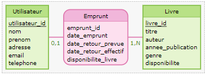

# MCD Organisateur de bibliothèque

### 1. Utilisateur

- utilisateur_id (Clé primaire)
- nom
- prénom
- adresse
- e-mail
- Téléphone

### 2. Livre

- livre_id (Clé primaire)
- titre
- auteur
- année_publication
- genre
- disponibilité

### 3. Emprunt

- emprunt_id (Clé primaire)
- utilisateur_id (Clé étrangère référençant Utilisateur)
- livre_id (Clé étrangère référençant Livre)
- date_emprunt
- date_retour_prevue
- date_retour_effectif

### Les associations :

- L'entité Emprunt est une association entre Utilisateur et Livre. Un emprunt est effectué par un utilisateur pour un livre spécifique.

## Diagramme du MCD :
```scss
      +-------------- +     +------------------+
      | Utilisateur   |     | Livre            |
      +---------------+     +------------------+
      | utilisateur_id|     | livre_id         |
      | nom           |     | titre            |
      | prenom        |     | auteur           |
      | adresse       |     | annee_publication|
      | email         |     | genre            |
      | telephone     |     | disponibilite    |
      +---------------+     +------------------+
            |                     |
            |  0,1                |
            |                     |
    +----+----------------+       |
    | Emprunt             |       |
    +---------------------+       |
    | emprunt_id (PK)     |       |
    | utilisateur_id (FK) |   1,N |
    | livre_id (FK)       |--------
    | date_emprunt        | 
    | date_retour_prevue  |
    | date_retour_effectif| 
    |disponibilite_livre  | 
    +---------------------+ 
```
## Diagramme [MOCODO](https://www.mocodo.net/)

```
Utilisateur: utilisateur_id, nom, prenom, adresse, email, telephone
Emprunt, 01 Utilisateur, 1N Livre: emprunt_id, date_emprunt, date_retour_prevue, date_retour_effectif,disponibilite_livre,
Livre: livre_id, titre, auteur, annee_publication, genre, disponibilite

// Utilisateur et Livre sont des entités 
// Emprunt est une assocciation
```
### Dans ce cas :

- Un utilisateur peut effectuer 0 ou 1 emprunt (01 Utilisateur).
- Un livre peut être emprunté par 1 ou plusieurs utilisateurs (1N Livre)
